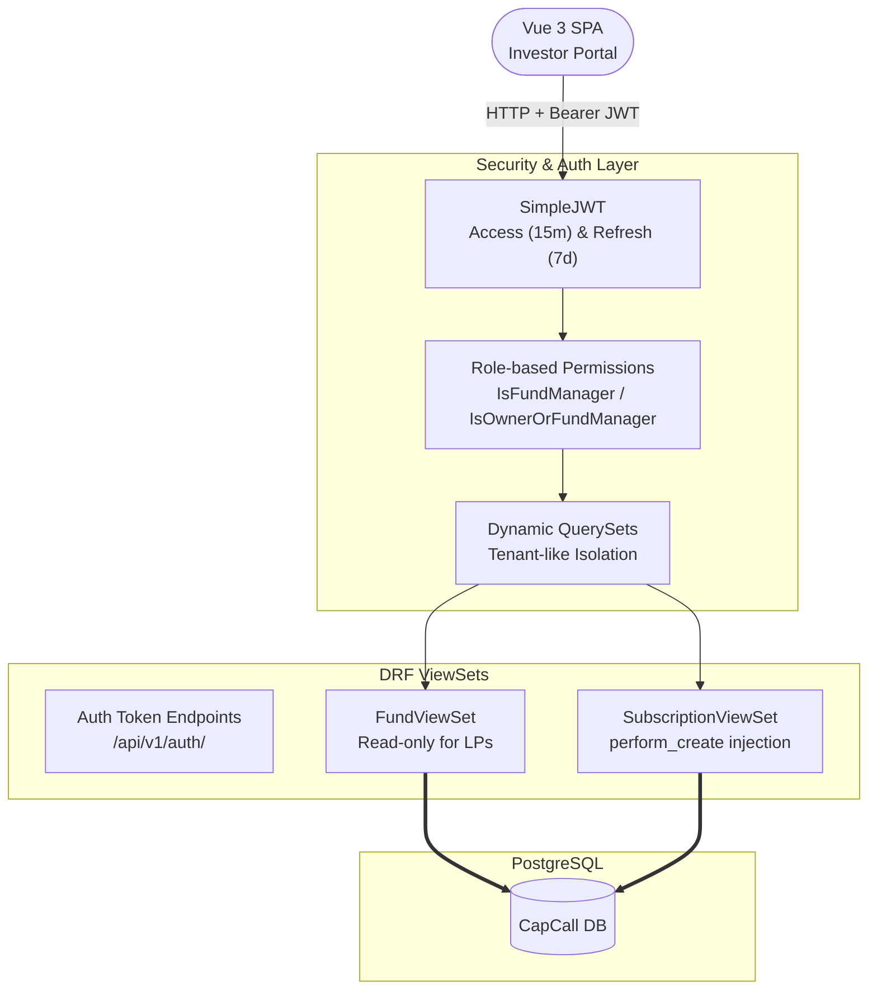
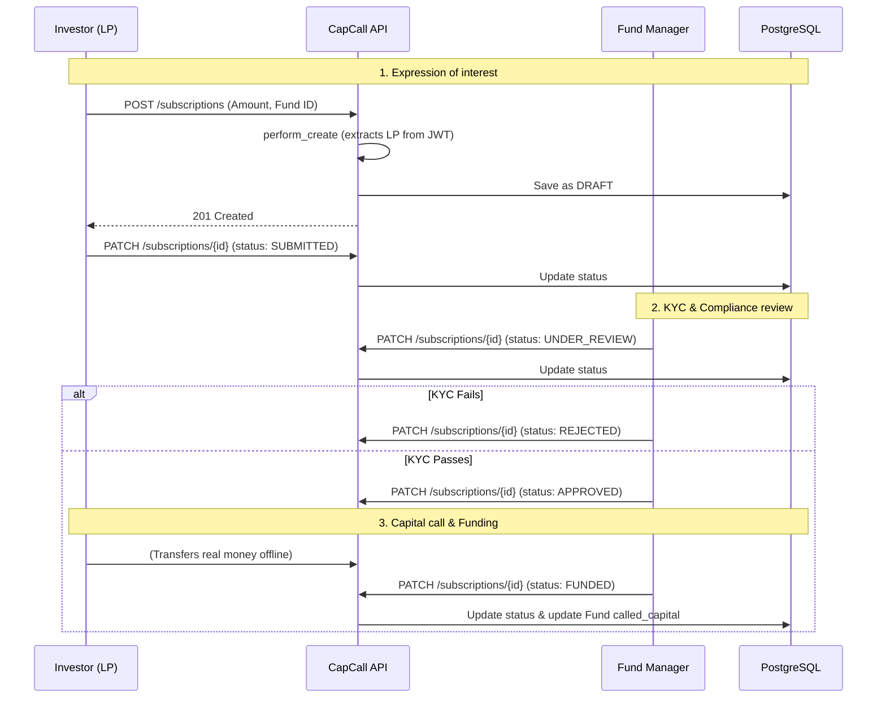

# CapCall

CapCall is a Django REST Framework backend that simulates a Private Equity fund management system, which includes 
handling capital subscriptions between Limited Partners (LPs) and Fund Managers. A minimal Vue.js frontend is included 
for demonstration purposes.

## Tech stack

| Component      | Technology                       |
|----------------|----------------------------------|
| Frontend       | Vue 3 + Vite                     |
| Backend        | Django + Django REST Framework   |
| Database       | PostgreSQL 16                    |
| Security       | SimpleJWT + CORS/CSRF Middleware |
| Infrastructure | Docker + Docker Compose          |

## Business logic

The application centers around three core models: **Fund**, **Investor** and **Subscription**.

* **Investors** must pass KYC (Know Your Customer) compliance.
* **Funds** follow a lifecycle (`FUNDRAISING` &rarr; `INVESTING` &rarr; `HARVEST` &rarr; `LIQUIDATED`) and employ 
  specific strategies (e.g., `BUYOUT`, `VENTURE`).
* **Subscriptions** represent the commitment of capital and follow a state machine:
  `DRAFT` &rarr; `SUBMITTED` &rarr; `UNDER_REVIEW` &rarr; `APPROVED` &rarr; `FUNDED` (or `REJECTED`).

### System architecture



### Key security features

- Investors (`is_staff=False`) can only query and view their own subscriptions. Fund Managers (`is_staff=True`) have 
  global visibility.
- To prevent users from subscribing others, the API ignores the investor ID in POST payloads (`required=False`). 
  Instead, the `perform_create` method intercepts the request and securely auto-assigns the investor based on the 
  validated JWT token.
- Object-level permissions (`IsOwnerOrFundManager`) ensure that even if querysets are bypassed, users cannot mutate 
  data they do not own.

### How it works: Subscription lifecycle



## API endpoints

The complete API documentation is automatically generated using OpenAPI. 
Once the backend is running, you can explore all endpoints using your preferred UI:

- Swagger UI (for interactive testing): http://localhost:8000/api/v1/schema/swagger-ui/
- Redoc (for clean reading): http://localhost:8000/api/v1/schema/redoc/

### Core business endpoints (Summary)

For a quick overview, these are the main endpoints that drive the application's core logic:

| Resource          | Endpoints                                  | Description                                                                     |
|:------------------|:-------------------------------------------|:--------------------------------------------------------------------------------|
| **Auth**          | `POST /api/v1/auth/token/*`                | JWT authentication (login, refresh, verify, blacklist).                         |
| **Funds**         | `GET, POST, PATCH /api/v1/funds/*`         | Fund catalog. Read-only for LPs & full CRUD for Managers.                       |
| **Investors**     | `GET, PATCH /api/v1/investors/*`           | Investor KYC profiles. Isolated visibility per user.                            |
| **Subscriptions** | `GET, POST, PATCH /api/v1/subscriptions/*` | The core lifecycle. Investors create DRAFTs and Managers approve and fund them. |

## Getting started

### Prerequisites

Docker and Docker Compose installed.

### Setup & Run

1. Clone the repository:

```bash
git clone https://github.com/guillemdiaz/capcall.git
cd capcall
```

2. Configure environment variables:

Create a `.env` file in the backend directory to store your Django `SECRET_KEY` and DB credentials *(A sample `.env.example` is provided.)*

3. Start the infrastructure:
   
This command will build the images, apply migrations and also start PostgreSQL, Django, and Vite in detached mode.

```bash
docker-compose up -d --build
```

4. Access the application:

- Frontend: http://localhost:5173
- Backend API: http://localhost:8000/api/v1/
- Django Admin: http://localhost:8000/admin/

### Demo accounts

The project includes a custom command to automatically seed the database with realistic 
Funds, Investors and Subscriptions. 

Run the following command to populate the database:

```bash
docker-compose exec web python manage.py seed_db
```

This will generate the following test accounts:

| Role         | Username    | Password       |
|--------------|-------------|----------------|
| Fund Manager | `manager`   | `test12341234` |
| Investor A   | `investor1` | `test12341234` |
| Investor B   | `investor2` | `test12341234` |

## Running tests

The backend includes multiple tests that cover model validation and role-based authorization.

```bash
docker-compose exec web python manage.py test
```